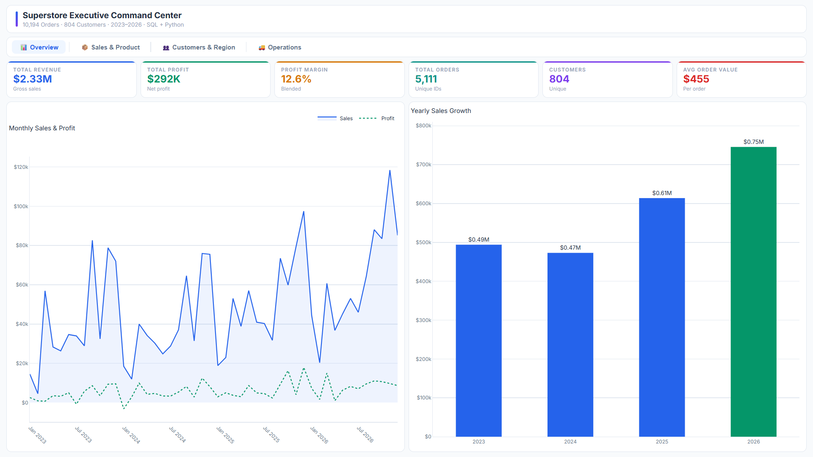
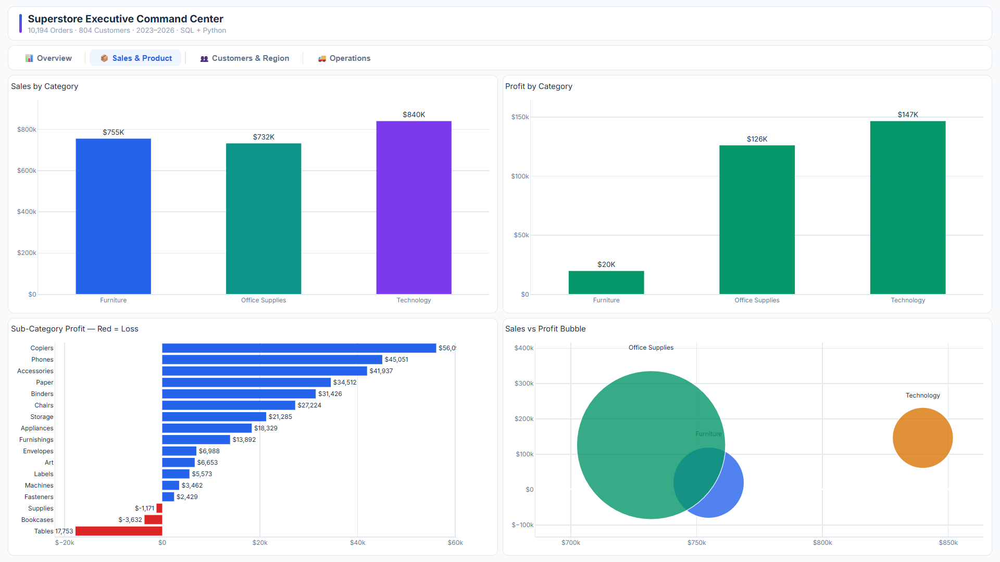
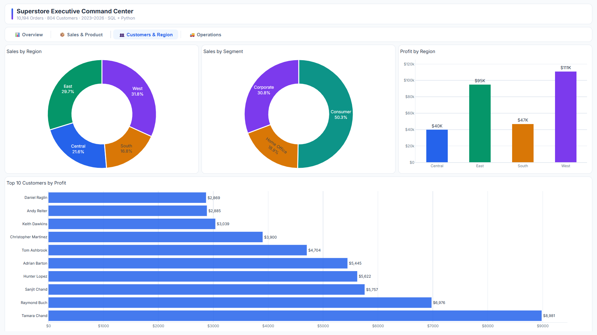
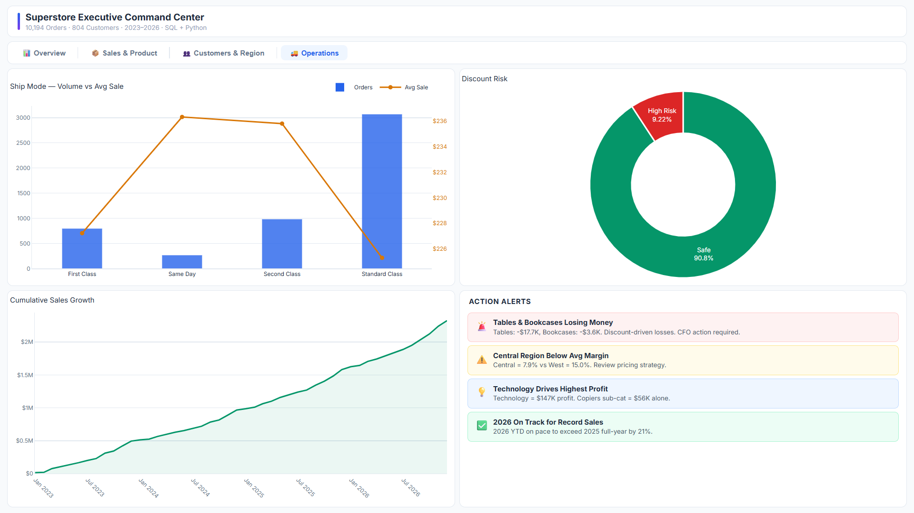

# Superstore Executive Dashboard

## Business Context

Retail businesses lose significant margin through poor discount strategies, underperforming product lines, and uneven regional performance — yet most teams lack a unified view to act on these patterns quickly.

This project analyses 9,994 orders across 4 years of Superstore transactional data using SQL Server, identifying $18K annual profit leakage, quantifying discount impact on margins, and delivering findings through a 4-page interactive Plotly Dash dashboard.

---

## Key Findings

| # | Finding | Number |
|---|---------|--------|
| 1 | Total revenue across 4 years | **$2.33M** |
| 2 | Annual profit leakage from loss-making sub-categories | **$18K (Tables: -$17.7K)** |
| 3 | Discounts above 20% consistently produce negative margins | **Proven across 3 sub-categories** |
| 4 | West region margin vs Central region margin | **14.2% vs 7.5%** |
| 5 | Top 10 customers contribution to total revenue | **15% ($350K)** |
| 6 | Star products (high revenue + high profit) | **Phones & Chairs** |
| 7 | Hidden leakage products (high revenue + negative profit) | **Tables & Bookcases** |

---

## Tech Stack

| Tool | Purpose |
|------|---------|
| SQL Server + SSMS | Data storage and analytical queries |
| T-SQL | Window functions, CTEs, views, aggregations |
| Python (Pandas, Plotly Dash) | Interactive 4-page dashboard |

---

## Project Structure

```
superstore-executive-dashboard/
│
├── orders.csv                        # Raw Superstore dataset — 9,994 orders
├── superstore_dashboard.py           # Plotly Dash 4-page interactive dashboard
│
│── 01_setup           
│── 02_views           
│── 03_core analysis   
│── 04_advanced analysis       
│
│
└── screenshots/
    ├── 01_overview.png
    ├── 02_sales and products.png
    ├── 03_customers and region.png
    └── 04_operations.png
```

---

## Methodology

### SQL Analysis
Queries progress from basic KPIs to advanced segmentation:

- **Core KPIs** — `SUM()`, `NULLIF()` for divide-by-zero safe margin calculation
- **Time trends** — `FORMAT(order_date, 'yyyy-MM')` for monthly aggregation
- **Product segmentation** — `CASE WHEN` matrix classifying sub-categories into Star, Hidden Leakage, Niche Opportunity, and Drop Candidate based on revenue and profit thresholds
- **Regional analysis** — comparative margin across 4 regions to identify performance gaps
- **Customer analysis** — top 10 by revenue, repeat customer identification using `COUNT(DISTINCT order_id) > 1`

### Product Segmentation Logic
```sql
CASE
    WHEN sales > 50000 AND profit > 5000  THEN 'Star'
    WHEN sales > 50000 AND profit <= 0    THEN 'Hidden Leakage'
    WHEN sales < 50000 AND profit > 0     THEN 'Niche Opportunity'
    ELSE 'Drop Candidate'
END AS segment
```

This quadrant approach gives the business a clear action framework — promote Stars, fix or drop Leakage products, nurture Niche opportunities.

### Dashboard — 4 Pages
Built with Plotly Dash, fully responsive, fits any browser window without zooming:

| Page | Visuals |
|------|---------|
| Overview | 6 KPI cards + monthly trend + yearly growth |
| Sales & Product | Category sales/profit + sub-category ranking + scatter bubble |
| Customers & Region | Region/segment donuts + region profit + top 10 customers |
| Operations | Ship mode analysis + discount risk + cumulative growth + action alerts |

---

## Dashboard Screenshots

### Page 1 — Overview


### Page 2 — Sales & Product


### Page 3 — Customers & Region


### Page 4 — Operations


---

## Business Recommendations

1. **Discontinue or re-price Tables** — $17.7K annual loss driven by heavy discounting. Cap discounts at 15% across Furniture sub-categories
2. **Replicate West region strategy in Central** — West achieves 14.2% margin vs Central's 7.5%. Pricing and discount discipline is the key differentiator
3. **Launch VIP programme for top 10 customers** — they generate 15% of revenue; a retention programme protects $350K in at-risk revenue
4. **Increase inventory focus on Phones & Chairs** — both are Star products with high revenue and healthy margins; incremental investment here has the clearest ROI

---
